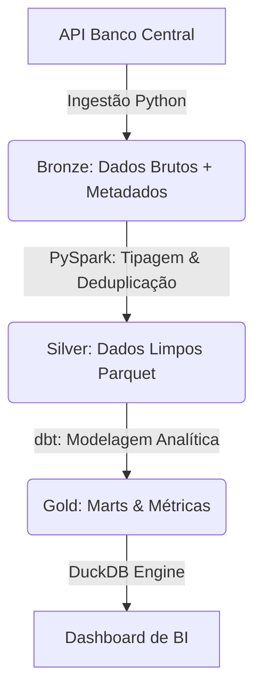

# 🏗️ Lakehouse Pipeline: Banco Central do Brasil (SELIC)
Uma arquitetura de dados ponta a ponta projetada para contornar limitações de APIs públicas e habilitar análises financeiras em um ambiente Lakehouse local (Zero-Infra).

## 📌 O Problema e a Solução
A API do Banco Central fornece dados fundamentais para modelagem financeira, mas impõe gargalos operacionais: requisições limitadas a janelas de 10 anos e retornos com tipagem inconsistente (strings genéricas).

**O objetivo deste projeto** é abstrair essa complexidade através de um pipeline automatizado que gerencia a paginação, garante a tipagem correta e separa estritamente a camada de Engenharia de Dados (processamento pesado) da camada de Analytics Engineering (regras de negócio).

## 📐 Arquitetura

O projeto adota o padrão Medallion (Bronze, Silver, Gold), garantindo que os dados sejam imutáveis na origem e progressivamente refinados.

🗂️ A Jornada do Dado (Medallion)
🥉 Bronze: Ingestão raw com controle de metadados (ts_load_bronze, source). Os dados são persistidos exatamente como chegam da API, garantindo reprocessamento sem necessidade de novas requisições externas.

🥈 Silver: Atuação do PySpark. Conversão de tipos (ex: string para double/date), normalização de schema e remoção de duplicados. O dado aqui é confiável e pronto para exploração ad-hoc.

🥇 Gold: Atuação do dbt. Onde o valor de negócio é gerado. Cálculo de métricas derivadas e modelagem dimensional para consumo final.

🧠 Decisões de Arquitetura & Trade-offs
Como engenheiro de dados, priorizei simplicidade de execução local sem sacrificar os padrões Enterprise:

Decoupling entre Processamento e Modelagem:

Utilizei Spark para o trabalho pesado de padronização, I/O e enforcement de schema.

Utilizei dbt exclusivamente para a camada semântica e regras de negócio. Isso permite que analistas de dados possam evoluir as métricas (Gold) sem precisar tocar no código de engenharia (Spark).

DuckDB + Parquet como Engine Local:

Evita a necessidade de subir containers complexos (como Postgres ou Trino) para consultas analíticas. O DuckDB lê os arquivos Parquet de forma vetorizada, entregando performance analítica nativa diretamente no sistema de arquivos.

Estratégia de Particionamento:

Os dados são organizados no Data Lake considerando a data de referência, otimizando o partition pruning (leitura apenas dos dados necessários) em cargas incrementais futuras.

🚀 Como Executar Localmente
Toda a complexidade de execução foi abstraída utilizando o Makefile.

1. Clone e configure o ambiente:

Bash
python -m venv venv
source venv/bin/activate
pip install -r requirements.txt

2. Execute o Pipeline:
Você pode rodar por etapas ou o fluxo completo:

Bash
# Executa apenas a ingestão da API até a camada Silver
make run_ingestion

# Executa apenas as transformações do dbt (Gold)
make run_dbt

# Executa o pipeline End-to-End
make run_all

🗺️ Roadmap e Próximos Passos
Esta arquitetura foi desenhada para ser facilmente portada para a Cloud. As próximas evoluções incluem:

[ ] Evolução de Formato: Migração de Parquet padrão para Delta Lake, habilitando Time Travel, operações DML (Merge/Update) otimizadas (Liquid Clustering) e ACID transactions.

[ ] Orquestração: Substituição do Makefile por DAGs no Apache Airflow para gerenciar dependências, retries e agendamento.

[ ] Cloud Migration: Portar o storage para AWS S3 e o catálogo de dados para o AWS Glue/Athena.

[ ] Data Quality: Implementação de testes genéricos e singulares no dbt (not_null, unique, accepted_values).

"Desenvolvido por Augusto Vieira — Data Engineer | PySpark · dbt · Lakehouse"
